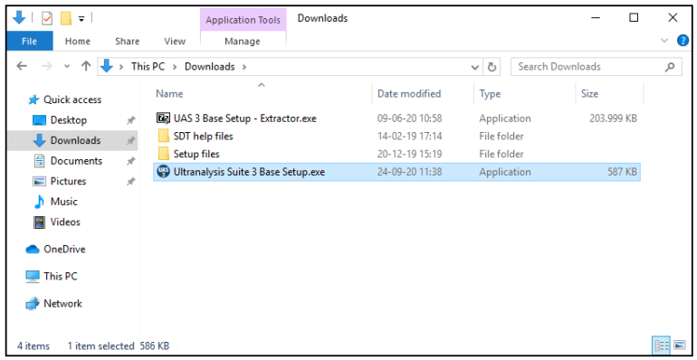

# 2. Ultranalysis® installation

## System requirements

- Compatible Operating Systems: Windows 8, 8.1, 10 - 64 Bits
- 1.6 gigahertz (GHz) or faster processor.
- 280 MB available hard disk space USB 1.1 or higher port.
- Sound card and audio output (Dynamic version only).

### Download Ultranalysis® Suite 3 Base Setup

If you don’t have it yet, you need to download “Ultranalysis Base Setup – Extractor.exe” file. It is
available at this location:

**[http://ftp.sdt.be/pub/Software/Ultranalysis%20Suite%203/BaseSetup/LatestVersion/UAS%203%20Base%20Setup%20-%20Extractor.exe](http://ftp.sdt.be/pub/Software/Ultranalysis%20Suite%203/BaseSetup/LatestVersion/UAS%203%20Base%20Setup%20-%20Extractor.exe)**

### Extract Base Setup

From your download folder (“C:\Download” is an example), double left click on the file “UAS 3 Base
Setup – Extractor.exe” to start the extraction of all setup files.
You should see this window:

By default, all files will be extracted at the same location as “UAS Base Setup – Extractor.exe” file, if you wish, you may specify another location at your convenience.
Click the “Extract” button to start the extraction.
The progress bar will show you the extraction progress, please wait until it’s finished.

When the extraction is finished, you should see (in the folder location you have specified) the same new files as shown on the following Screenshot:

## Run Base Setup
You must have Administrator rights to proceed from here.
Double click on the file "Ultranalysis Suite 3 Base Setup.exe" to start Base Setup installation.
You should see the following window:

Select the install type and click the Next button to continue.
Read the End User License Agreement and if you agree with it, select “I accept the agreement”.
Click the Next button to continue.
This step will list all the components the Base Setup will install to your computer.
Click the Install button to continue.

### Microsoft Visual C++ Redist 2013

If the Base Setup was required to install Microsoft Visual C++ 2013 Redistributable (x64), you should see the following window:

Depending on your computer performances, it could take few minutes.

### Crystal Reports

If the Base Setup needed to install Crystal Reports, you should see the following window:

Depending on your system performance it could take a few minutes.
Click the **Next** button to continue.

Read the End User License Agreement and if you agree with it, select “I accept the agreement”.

Click the **Next** button to continue.

Click the **Finish** button to finish to installation of Crystal Reports.

### 2.7. PostGreSQL

If the Base Setup needs to install PostGreSQL database, you should see the following windows:
Please also make sure you have uninstalled an old version (In the search box on the windows taskbar,
type Control Panel and select it from the results, Select Programs > Programs and Features.
Press and hold (or right-click) on PostgreSQL Database server (<13) you want to remove and select
Uninstall)

Click the **Next** button to continue, then select **your Installation directory** (default directory) and click
the **Next** button to continue.

Select **the recommended settings** and click the **Next** button to continue. The left window lists which
components will be installed for the PostGreSQL installation. Only **PostgreSQL Server** is mandatory for
UAS3.
Click the **Install** button to continue.

Provide a password to manage your database, click next. Select the default **port 5432** and click the

**Next** button. If another port is proposed, you must uninstall the old version.

Finalize the installation by clicking **Next.**

Depending on your system’s performance it could take a few minutes. When PostGreSQL installation

is finished you should see the following window:

Click the **Finish** button to complete PostGreSQL installation and continue with our Base Setup.

The database service should be launch as a service, in Windows. Make sure that PostgreSQL Database
server (v13) is locally running, in automatic mode, as follows:

### 2.8. Ultranalysis® Suite

The final part of Base Setup is the installation of Ultranalysis® Suite.

You should see the following window:

Click the **Next** button to continue.

Read the End User License Agreement and if you agree with it, select **I Agree**.

Click the **Next** button to continue.

Select here the Destination folder location for Ultranalysis® Suite. Click the **Next** button to continue.

This window will list which component will be installed on your system.

Click the **Next** button to continue.

Click the **Close** button to finish Ultranalysis® Suite 3 installation.