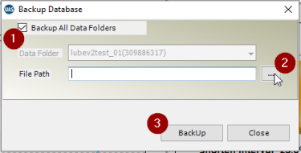

# Backup and Restore Procedures

It is a good practice to backup your database at regular intervals. The schedule for backups is up to the individual needs of each company. The database is not automatically backed up and must completed manually each time.

The backup file will grow in size over time as you collect more data. For static data it should stay relatively small, but for dynamic data ( timewaveforms and spectrum ) the database backup can easily grow in the gigabyte(s) range

## Backup database

Open the UAS application
Go to ***'Utilities->Database->Backup->Full UAS Database'***

When prompted select a location to store the database backup:

1. Make sure the ***'Backup All Data Folders'*** box is **Checked**
2. Click on the ***'...'*** to select a location to store the database and give the backup a filename. All data is backed up to a single SQL backup file.
3. Click on the ***'Backup'*** button to start the backup.

## Restore database

Open the UAS application
Go to ***'Utilities->Database->Restore->Full UAS Database'***

When prompted select the database backup to restore:

1. Click on the ***'...'***  to select the location to restore the database from. (where you placed the backup file from the previous steps)
2. Click on the ***'Restore'*** button to start the backup.

!!! check "On Success"
    After a successful restore you will need to restart you UAS application to see the database changes.

!!! note "NOTE:"
    If you don’t see your new database after restarting UAS, go to ***‘File->Tree Structure’*** and check for the available **DataFolders**:
    Select the *DataFolder* you want to use and the *TreeStructure* and then click ***‘Open’*** on the bottom.
