# Database Migration Guide

!!! note "Version 1" 
    2021 © SDT International. 
    All rights reserved. Specifications are subject to change without notice.

## How to migrate Database Server

### UAS3 Network Version

!!! note
    For network installations with a shared database, you must update the UAS3 clients first, then the database server.

!!! warning
    For UASLite and UAS3 users who use both solutions on the same computer, you must update the UAS3 and UASLite first, then the database server.

#### UAS3 & UASlite

If you update the PostgreSQL before updating UAS3 or UASLite then an error may appear on startup of software.

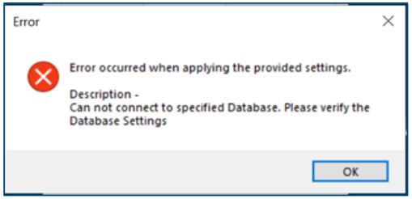

In this case, you must do the software update manually from the SDT Ultrasound Solutions website.

UAS3 update: https://sdtultrasound.com/download/6525/

UASLite update: https://sdtultrasound.com/download/586/

### UAS3/UASlite Migration Data Server

After upgrading your UAS 3 and UASLite to the latest version, launch the software.

UAS3/UASLite will detect that a new Database Server version is available. See picture below.

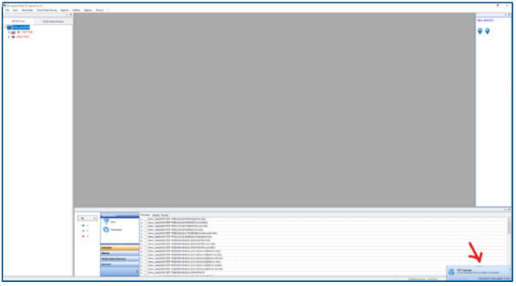

Click to open the download window.

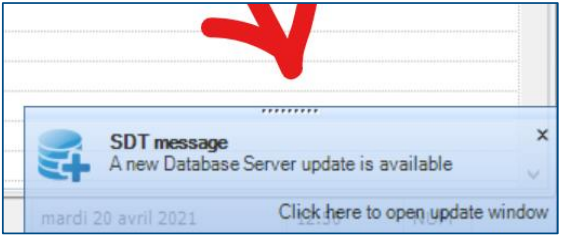

You should see the following window:

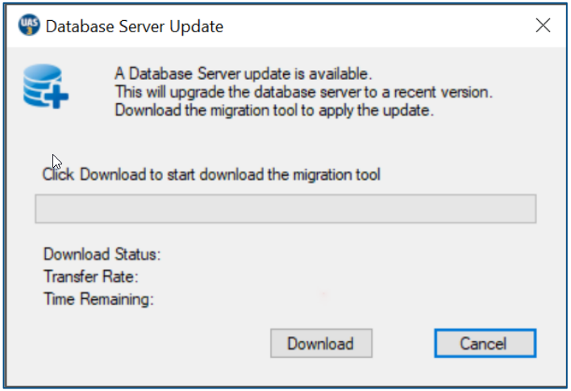

Click **Download** to start download the migration tool.

Wait until the download is completed.

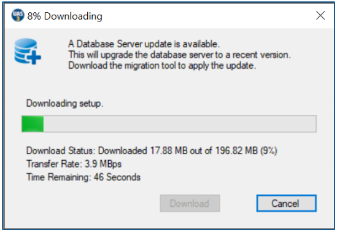

When the download is completed click **Ok** on the next window to exit UAS3/UASLite and start installation of the Migration Tool.

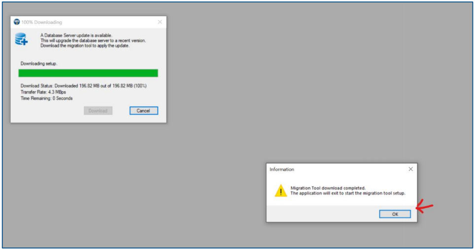

After UAS3/UASLite exit, you will see the window below. Click **Install** to start the installation.

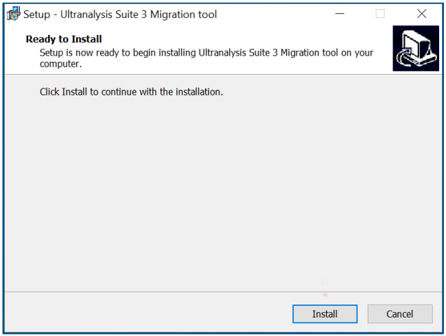

## Migrate Database Server

When the installation is completed, the Migration Tool will start.

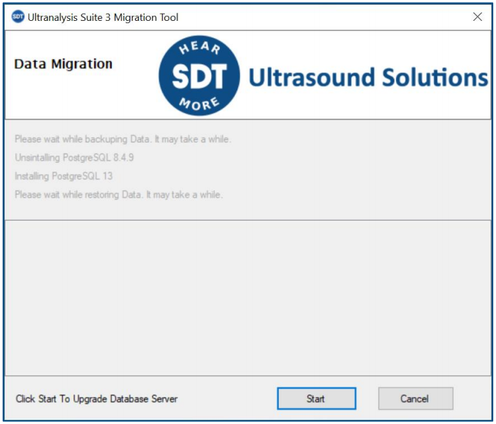

By clicking **Start** , the tool will:

1. Make a full backup of your UAS3.
2. Uninstall the current Database Server (PostgreSQL 8.9.4)
3. Install the new Database Server (PostgreSQL 13.1)
4. Restore the backup, made in step, into the new Database Server.

#### Step 1: Backup the data

This step may take a very long time depending on the amount of data. So, wait...

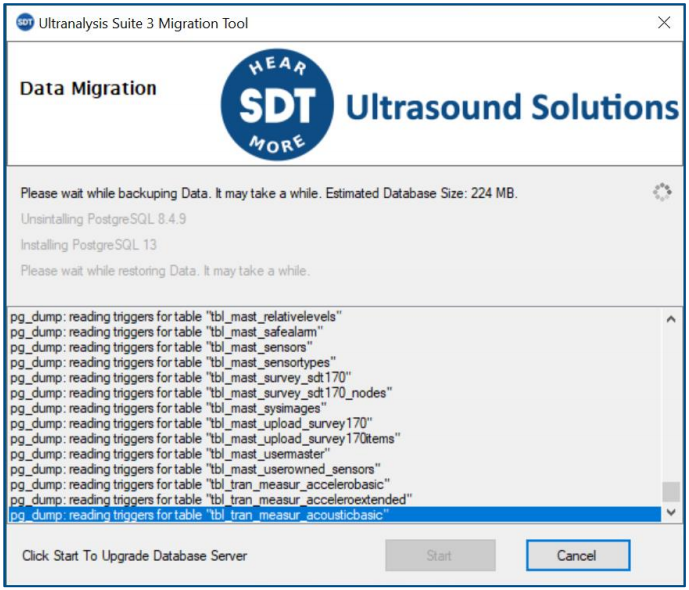

#### Step 2: Uninstall current Database Server

When the backup is completed, the uninstallation of the current Database Server will start.

Accept by clicking **Yes**.

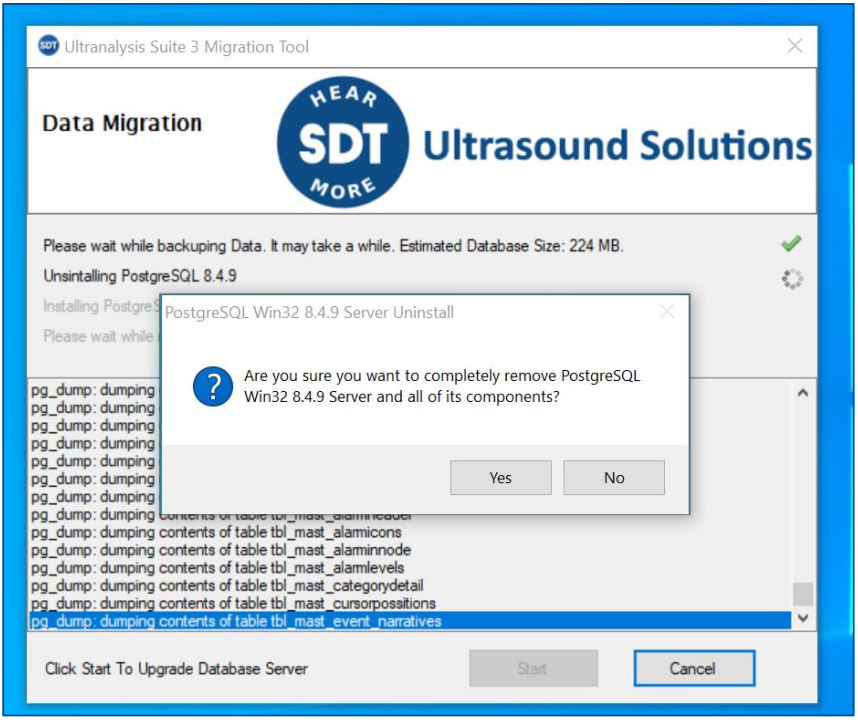

Click **Ok** to confirm the uninstallation.

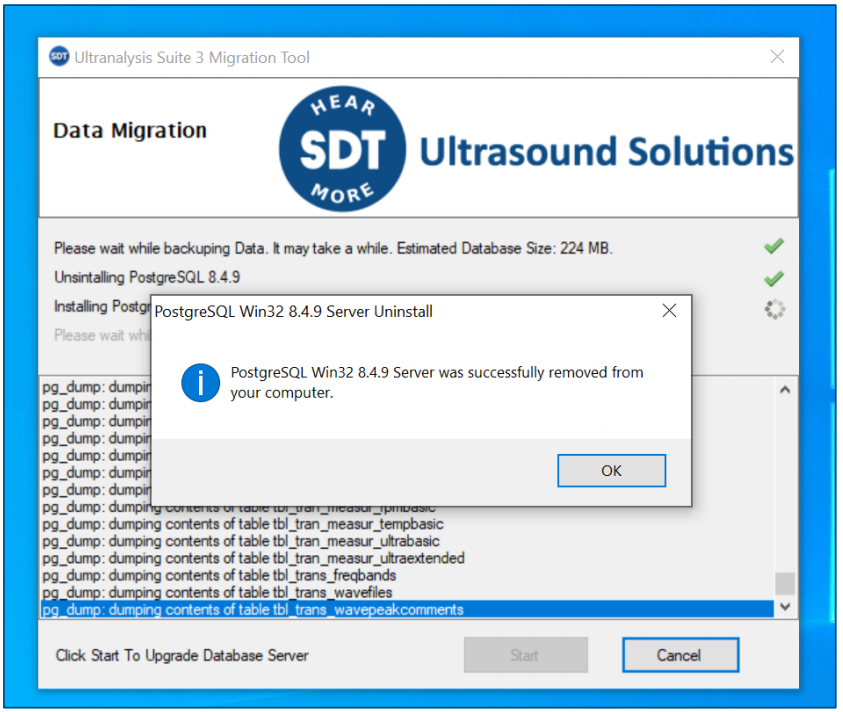

#### Step 3: Installation of the new Database Server start automatically

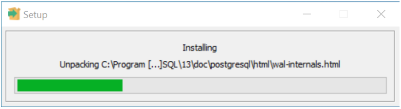

Wait...

#### Step 4 : Restore backup

The restore of the backup made in step 1 will automatically start.

This may take a long time. So be patient.

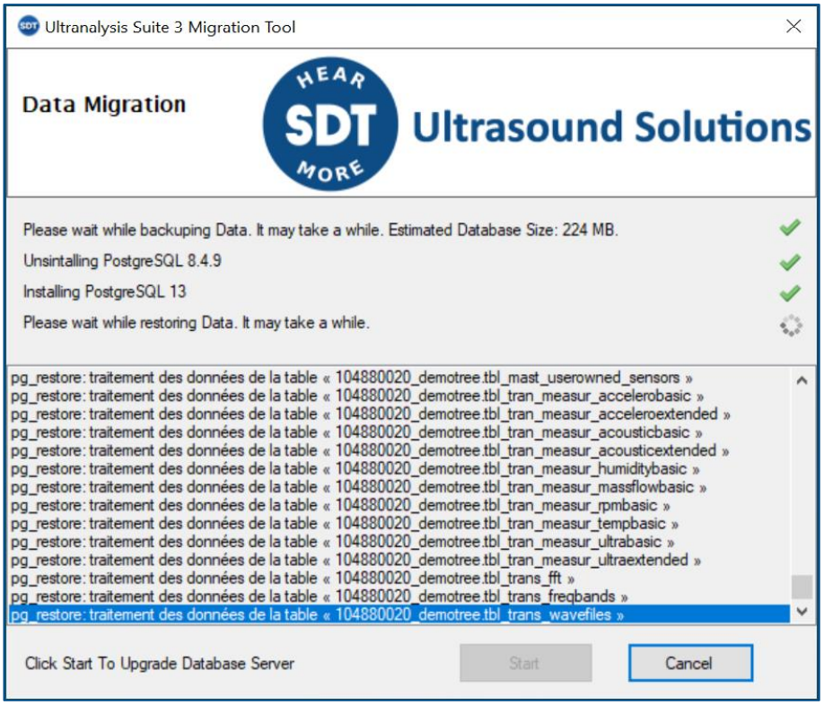

When the restore is finished, Data Migration Tool will automatically close itself.

**You can now start UAS3/UASLite.**