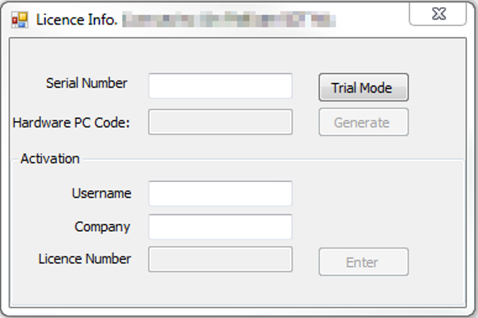

# UAS Network Software Installation

## Hardware Requirements

**Server OS:** Any version of MS Server 2008 and above
**Disk Space:** 250MB for the application and 10-20 GB for user data
**Memory (RAM):** 4GB

### Server Software

Please use the version of PostgreSQL provided by SDT:

**[http://ftp.sdt.be/pub/Software/Ultranalysis%20Suite%203/Database/postgresql-13.1-x64.exe](http://ftp.sdt.be/pub/Software/Ultranalysis%20Suite%203/Database/postgresql-13.1-x64.exe)**

The software is compatible with the current version of UAS software and the installer is tuned for network servers.

**Installation is straightforward, please follow the default prompts and apply those settings.**

During the installation, the installer will ask to set the password for the *‘postgres’* user account. This account is required for starting and stopping the postgresql database service.

Set the password to the following:  **PasswordPassword123**

The client application uses this password by default.  The ‘postgres’ user account serves no other purpose and requires no administrative privileges.

!!! warning
    At the end of the installation, the installer asks to install *StackBuilder*. **We do NOT use *StackBuilder*** for UAS and it is therefore, not necessary to install.

<div style="page-break-after: always;"></div>

### PostgreSQL Service Configuration

The following information is required to ensure a successful connection between the client/server applications:

  1. *IP address of the server* - this is necessary for the client PCs to access the server
  2. *IP ranges for the client PCs* - any valid ip range for the clients PCs that will be connecting to the database.  This can be multiple address ranges.

#### Allow Client PC Access

To allow a UAS client application to connect to the database you **MUST** edit the ***pg_hba.conf*** configurtation file and add all the client IP ranges collected in *Step 2* above.

This file is located here :
***C:\Program Files\PostgreSQL\13\data***

Edit the section at the bottom of the file that looks like this:

````pgsql
# TYPE  DATABASE        USER            ADDRESS                 METHOD

# "local" is for Unix domain socket connections only
local   all             all                                     scram-sha-256
# IPv4 local connections:
host    all             all             127.0.0.1/32            scram-sha-256
# IPv6 local connections:
host    all             all             ::1/128                 scram-sha-256
# Allow replication connections from localhost, by a user with the
# replication privilege.
local   replication     all                                     scram-sha-256
host    replication     all             127.0.0.1/32            scram-sha-256
host    replication     all             ::1/128                 scram-sha-256
host    all             all             0.0.0.0/0            	scram-sha-256
````

#### IPv4 local connections

This section of the config file is where the client ranges are added. You can add clients indivually or as ranges:

For an individual PC:

````pgsql
# IPv4 local connections:
host    all         all         127.0.0.1/32        scram-sha-256
host    all         all         10.10.12.26         trust
````

For a range of IP addresses

````pgsql
# IPv4 local connections:
host    all         all         127.0.0.1/32        scram-sha-256
host    all         all         10.10.12.0/24       trust
````

!!! info
    More detailed documentation can be found here at the *[PostgreSQL 8.4 Documentation Site](https://www.postgresql.org/docs/8.4/auth-pg-hba-conf.html)*

#### Database Service Configuration

The postgresql.conf controls setting for the database service.  The file can be found here: <br>***C:\Program Files (x86)\PostgreSQL\13\data***

Make sure these setting changes have been made:

````pgsql
listen_addresses = to ‘*’
port = 5432
````

**Those are the minimal changes required to make the service run.**

#### Error Logging

If you are having issues with the client PC's connecting, turn on the postgres service **Error Logging**. By default this is set to minimal to prevent it from filling up hard drive space unnecessarily.

Edit the postgresql.conf file and find the section titled *‘ERROR REPORTING AND LOGGING’*. Set the values to those listed below:

````pgsql
#------------------------------------------------------------------------------
# ERROR REPORTING AND LOGGING
#------------------------------------------------------------------------------
.
.
.
log_destination 	= stderr
logging_collector 	= on
log_directory 		= pg_log
client_min_messages = debug3
log_connections 	= on
log_dsconnections 	= on
log_hostname 		= on
````

!!! info
    For a more detailed explanation of the Error Log settings, please refere to the [Postgres Documentaion - Errpr Reporting and Logging](https://www.postgresql.org/docs/13/runtime-config-logging.html)

All log data is stored in the ‘pg_log’ folder with one file per day. Open the file in notepad to view any connection errors
*all of these can be turned off once the clients are setup*

<div style="page-break-after: always;"></div>

### Client  Software Installation

Run the installation program on the USB disk provided or download the software here:

[http://ftp.sdt.be/pub/Software/Ultranalysis%20Suite%203/BaseSetup/LatestVersion/UAS%203%20Base%20Setup%20-%20Extractor.exe](http://ftp.sdt.be/pub/Software/Ultranalysis%20Suite%203/BaseSetup/LatestVersion/UAS%203%20Base%20Setup%20-%20Extractor.exe)

Choose the second option to connect to a remote database:

The client program is installed in two parts:

1. Install the necessary support libraries to run Ultranalysis Suite: *.NET framework and Crystal Reports engine*
2. Install the Ultranalysis Suite Software

!!! check "Accept Defaults"
    *Follow the prompts, there are no setting required at this stage.*

#### License Client PC's

Once the installation is complete, you must launch Ultranalysis Suite to license the software. The license screen will appear until it has been properly configured. The software can only run in Demo mode without a proper license and will have liimited functionality.

Ultranalysis Suite is licensed per PC and uses a combination of the serial number and various hardware id's on the client PC to generate a license code.  Each end user will be emailed a serial number and instructions on how to obtain a license number.

Enter the Serial Number and click on **‘Generate’** to create a Hardware PC Code.

To obtain a license number go to this webpage:

[https://www.sdt.be/extranet/licenses/activate](https://www.sdt.be/extranet/licenses/activate)

You will need the *Serial Number and Hardware PC Code* to continue. Once you have the license number return to the Ultranaly Suite software to enter all three numbers and your name and company name:



#### Set Database Connection

Once you have successfully licensed the software you will be prompted to create a database connection:

Click the checkbox for the 'Advanced Settings' and change the 'Host' from 'localhost' to the IP address of the postgres database server.  If you changed the password for the postgres user account on the server you will need to change the password here, otherwise leave the settings as they are and click 'Apply'.  You should receive a message that the database connection was created successfully, if you do not, go back through your settings and make sure all IP addresses are correct and that you have added the client IP ranges to the configuration files on the server.

<div style="page-break-after: always;"></div>

## Resources

Ultranaysis Suite Standard Installation Instructions

[ftp://ftp.sdt.eu/pub/Software/Ultranalysis%20Suite/UserManuals/LatestVersion/Ultranalysis_Suite_installation.pdf](ftp://ftp.sdt.eu/pub/Software/Ultranalysis%20Suite/UserManuals/LatestVersion/Ultranalysis_Suite_installation.pdf)

Ultranalysis Suite User Manual

[ftp://ftp.sdt.be/pub/Software/Ultranalysis%20Suite/UserManuals/LatestVersion/UAS_manual_en.zip](ftp://ftp.sdt.be/pub/Software/Ultranalysis%20Suite/UserManuals/LatestVersion/UAS_manual_en.zip)

Automated backups

[http://wiki.postgresql.org/wiki/Automated_Backup_on_Windows](http://wiki.postgresql.org/wiki/Automated_Backup_on_Windows)

<small>*The above is generic for any Postgres installation - but should work fine in this instance.*</small>

The full documentation for Postgres is here:

[https://www.postgresql.org/docs/13/index.html](https://www.postgresql.org/docs/13/index.html)
